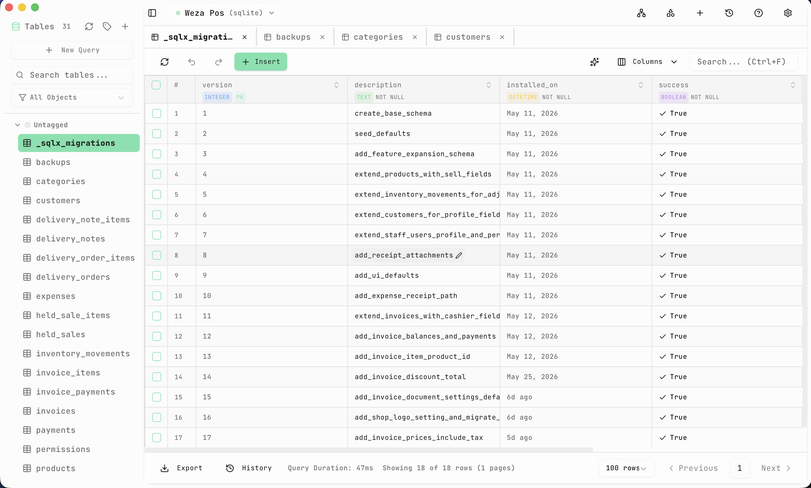
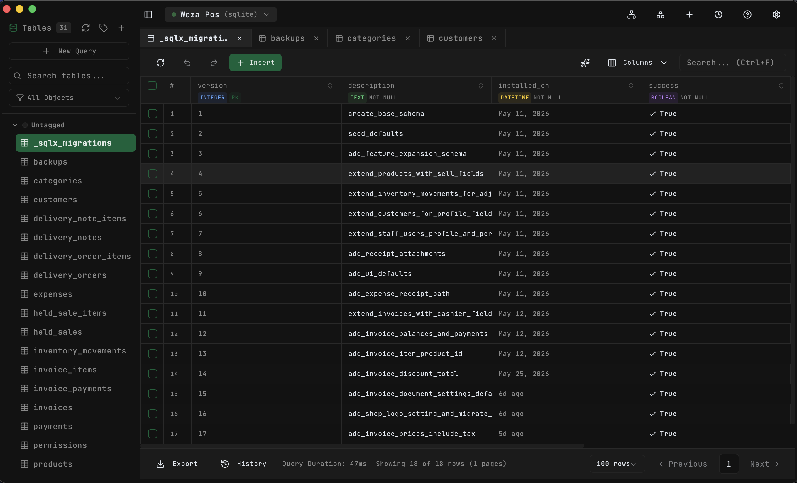

# NodaDB

A modern, cross-platform database management tool built with Tauri 2, React, and Rust.

## Screenshots





## Features

- **Multi-Database Support** - Connect to SQLite, PostgreSQL, and MySQL
- **Visual Table Explorer** - Browse and navigate database schemas
- **SQL Query Editor** - Monaco-powered editor with syntax highlighting
- **CRUD Operations** - Insert, update, and delete rows with inline editing
- **Schema Designer** - Create and modify tables visually
- **Query History** - Track, search, and favorite your queries
- **Export Data** - Download results as CSV

## Tech Stack

**Frontend:** React 19, TypeScript, Tailwind CSS, shadcn/ui, Monaco Editor  
**Backend:** Rust, Tauri 2, SQLx, Tokio  
**Runtime:** Bun

## Getting Started

### Prerequisites

- Bun (JavaScript runtime)
- Rust (latest stable)
- System dependencies for Tauri:
  - **Linux:** `webkit2gtk`, `libgtk-3-dev`, `libsoup2.4-dev`
  - **macOS:** Xcode command line tools
  - **Windows:** WebView2

### Installation

```bash
# Clone repository
git clone <repository-url>
cd NodaDB

# Install dependencies
bun install

# Run in development
bun run tauri dev

# Build for production
bun run tauri build
```

### macOS Icon Setup (Liquid Glass)

For macOS 26+ Liquid Glass icon support, you need to manually generate an `Assets.car` file:

1. **Verify actool is available:**
   ```bash
   xcrun actool --version
   ```

2. **Check your `.icon` file:**
   ```bash
   find src-tauri/icons/AppIcon.icon -maxdepth 3 -type f -print
   ```

3. **Generate Assets.car manually:**
   ```bash
   rm -rf /tmp/nodadb-icon-out
   mkdir -p /tmp/nodadb-icon-out

   xcrun actool \
     src-tauri/icons/AppIcon.icon \
     --compile /tmp/nodadb-icon-out \
     --output-format human-readable-text \
     --notices \
     --warnings \
     --errors \
     --output-partial-info-plist /tmp/nodadb-icon-out/assetcatalog_generated_info.plist \
     --app-icon AppIcon \
     --include-all-app-icons \
     --enable-on-demand-resources NO \
     --development-region en \
     --target-device mac \
     --minimum-deployment-target 26.0 \
     --platform macosx
   ```

4. **Copy generated Assets.car to icons folder:**
   ```bash
   cp /tmp/nodadb-icon-out/Assets.car src-tauri/icons/Assets.car
   ```

5. **Update `tauri.conf.json`:**
   ```json
   {
     "bundle": {
       "icon": [
         "icons/32x32.png",
         "icons/128x128.png",
         "icons/128x128@2x.png",
         "icons/icon.icns",
         "icons/icon.ico",
         "icons/Assets.car"
       ]
     }
   }
   ```

   **Important:** Remove `icons/AppIcon.icon` from the bundle config if you encounter actool errors.

6. **Rebuild:**
   ```bash
   rm -rf src-tauri/target
   bun run tauri build
   ```

The built app bundle should now contain both `Assets.car` (for Liquid Glass) and `icon.icns` (fallback).

## Usage

### Connect to Database

1. Click "New Connection"
2. Enter connection details:
   - **SQLite:** Browse and select `.db` file
   - **PostgreSQL/MySQL:** Enter host, port, credentials
3. Click "Connect"

### Browse and Edit Data

- Click tables in the sidebar to view data
- **Insert:** Click "Add Row" button
- **Update:** Double-click any cell to edit
- **Delete:** Select rows and click "Delete"
- Navigate with pagination controls

### Execute SQL Queries

- Switch to "Query" tab
- Write SQL in the editor
- Press `Ctrl+Enter` to execute
- Export results as CSV

### Manage Schema

- Hover over tables for context menu
- Create new tables with visual designer
- Add columns, set constraints
- Drop or rename tables

### Query History

- All queries saved automatically
- Search and filter history
- Star favorites
- Re-run queries with one click

## Keyboard Shortcuts

- `Ctrl+Enter` - Execute query
- `Enter` - Save cell edit
- `Escape` - Cancel edit
- `Double-click` - Edit cell

## Project Structure

```
NodaDB/
├── src/                    # React frontend
│   ├── components/         # UI components
│   ├── stores/            # State management
│   └── types/             # TypeScript types
├── src-tauri/             # Rust backend
│   ├── src/
│   │   ├── commands/      # Tauri commands
│   │   ├── database/      # Connection logic
│   │   └── models/        # Data structures
│   └── Cargo.toml
└── package.json
```

## Roadmap

- [x] Multi-database connections
- [x] Table viewer with pagination
- [x] SQL query editor
- [x] CRUD operations
- [x] Schema designer
- [x] Query history
- [ ] Data filtering and sorting
- [ ] Foreign key management
- [ ] Visual query builder
- [ ] ERD visualization
- [ ] Dark/light theme toggle
- [ ] Database migrations

## Contributing

Contributions welcome! Fork the repo, create a feature branch, and submit a PR.

## License

MIT

## Acknowledgments

Built with [Tauri](https://tauri.app/), [shadcn/ui](https://ui.shadcn.com/), and [SQLx](https://github.com/launchbadge/sqlx).
